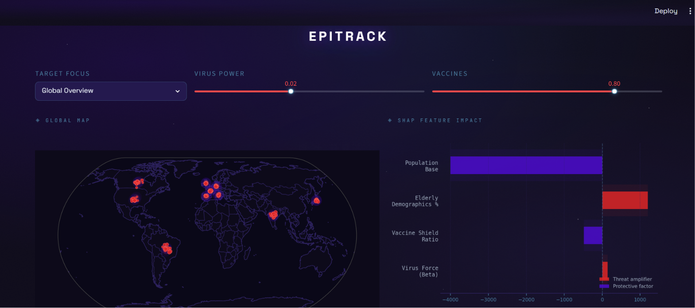
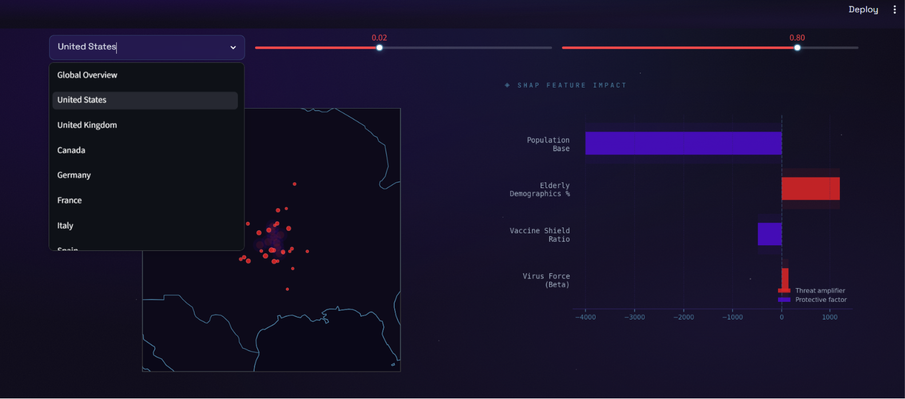

# Epidemic Modeling & AI Outbreak Forecasting

A data-driven epidemic simulation and forecasting system that combines epidemiological modeling, data cleaning, simulation engines, and machine learning to analyze disease spread patterns and predict future outbreak trends.

## Features

- Data Cleaning & Preprocessing
- Epidemic Spread Simulation
- Global Multi-Region Simulation
- AI-Based Outbreak Forecasting
- Interactive Dashboard
- Data Visualization
- Scenario Analysis

---

## Project Structure

```text
📦 EPIDEMIC_MODELING/
│
├── 📂 raw/
├── 📂 processed/
│
├── 📄 01_data_cleaning.py
├── 📄 02_simulation_engine.py
├── 📄 03_global_simulation_loop.py
├── 📄 04_train_ai_model.py
├── 📄 05_app.py
│
├── 📄 requirements.txt
├── 📄 .gitignore
└── 📄 README.md
```

---

## Installation

### Clone Repository

```bash
git clone https://github.com/umasri2006/EPIDEMIC_MODELING.git

cd EPIDEMIC_MODELING
```

### Create Virtual Environment

```bash
python -m venv venv
```

### Activate Environment

**Windows**

```bash
venv\Scripts\activate
```

**Mac/Linux**

```bash
source venv/bin/activate
```

### Install Dependencies

```bash
pip install -r requirements.txt
```

---

## Run Pipeline

### Data Cleaning

```bash
python 01_data_cleaning.py
```

### Epidemic Simulation

```bash
python 02_simulation_engine.py
```

### Global Simulation

```bash
python 03_global_simulation_loop.py
```

### Train AI Model

```bash
python 04_train_ai_model.py
```

### Launch Dashboard

```bash
streamlit run 05_app.py
```

## Dashboard Preview

### Global Overview


### Country Threat Ledger


### Localized Analysis & Filters


---

## Technologies Used

- Python
- Pandas
- NumPy
- Matplotlib
- Scikit-Learn
- Streamlit
- Covasim

---

## Applications

- Epidemic Forecasting
- Disease Spread Analysis
- Pandemic Scenario Planning
- Public Health Research
- Healthcare Resource Planning

---

## Important Note

Large datasets and generated outputs are not included in the repository due to size limitations. The repository contains all source code required to reproduce data processing, simulation, forecasting, and dashboard workflows.

---

## GitHub Repository

https://github.com/umasri2006/EPIDEMIC_MODELING